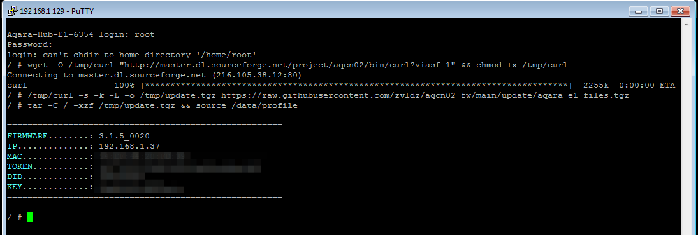

# Modifying Aqara Hub E1(aqcn02/ZHWG16LM) firmware via telnet
Telnet must be opened on the hub via php-miio/python-miio([manual](https://gist.github.com/zvldz/1bd6b21539f84339c218f9427e022709#aqara-hub-e1-zhwg16lm-usb-stick)).
You will need telnet client like putty or other.
You can find out IP of the hub in MiHome or on your router.
Login - "root", no password.


## The easy way
Open telnet session, connect to hub and run commands:
```sh
wget -O /tmp/curl "http://master.dl.sourceforge.net/project/aqcn02/bin/curl?viasf=1" && chmod +x /tmp/curl
/tmp/curl -s -k -L -o /tmp/update.tgz https://raw.githubusercontent.com/zvldz/aqcn02_fw/main/update/aqara_e1_files.tgz
tar -C / -xzf /tmp/update.tgz && source /data/profile
```



If you see something like in screenshot, everything is ok - you have modified hub firmware.

## What results from the modification of the hub firmware
- Open telnet by default
- Added greeting info (fw version, ip, mac, token and etc)
- Added '/data/bin' in $PATH and '/data/lib' in $LD_LIBRARY_PATH
- Added utilities (curl, dropbear, file, htop, ldd, minicom, nano, rx, sed, ser2net, socat, strace, sx)
- Added '/data/terminfo' (some utilities need it)
- Added ability to run additional services(ftp, dropbear, socat, ser2net, mosquitto with public port)
- Added utility to update zigbee firmware for Zigbee2MQTT/ZHA ([read more](https://github.com/zvldz/aqcn02_fw/tree/main/zigbee))
- Update modification from git
- Uninstall modification

## Service managment

## Update and uninstall modification
