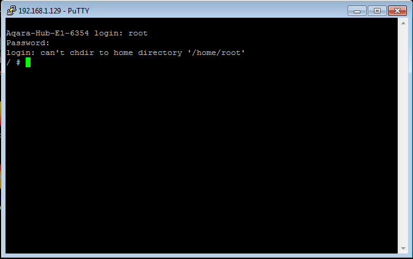

# Updating zigbee firmware of Aqara Hub E1(aqcn02/ZHWG16LM) via telnet for Zigbee2MQTT/ZHA
Telnet must be opened on the hub via php-miio/python-miio([manual](https://gist.github.com/zvldz/1bd6b21539f84339c218f9427e022709#aqara-hub-e1-zhwg16lm-usb-stick)).
And a firmware [modification](https://github.com/zvldz/aqcn02_fw/tree/main/update) must be installed.
You will need telnet client like putty or other. You can find out IP of the hub in MiHome or on your router. Login - "root", no password.
Open telnet session, connect to hub and run commands:
```sh
zigbee_flash.sh
```

You will need to select firmware version:
  * ncp-uart-sw_aqcn02_6_7_10_mod.gbl for Zigbee2MQTT/ZHA
  * ncp-uart-hw_aqcn02_6_6_5_stock.gbl for return to stock firmware


If you see something like in screenshot, everything is ok - you have updated zigbee firmware and you can configure Zigbee2MQTT/ZHA.
You also need to create an '/data/enable_socat' or '/data/enable_ser2net' file to work with Zigbee2MQTT/ZHA and reboot the hub.

Example of part of the config for Zigbee2MQTT:
```yaml
serial:
    adapter: ezsp
    port: 'tcp://192.168.1.177:8888'
```

Configuration example for ZHA:



Data flow control must be 'software' (at the moment)

If you want to return to MiHome with hub, you need to flash stock firmware (ncp-uart-hw_aqcn02_6_6_5_stock.gbl) and delete file '/data/enable_socat' or '/data/enable_ser2net' and reboot the hub.


## Thanks
zigbee_flash.sh is based on @CODeRUS script.

Firmware for Zigbee2MQTT/ZHA complied by Alexander Faronov(@faronov).
